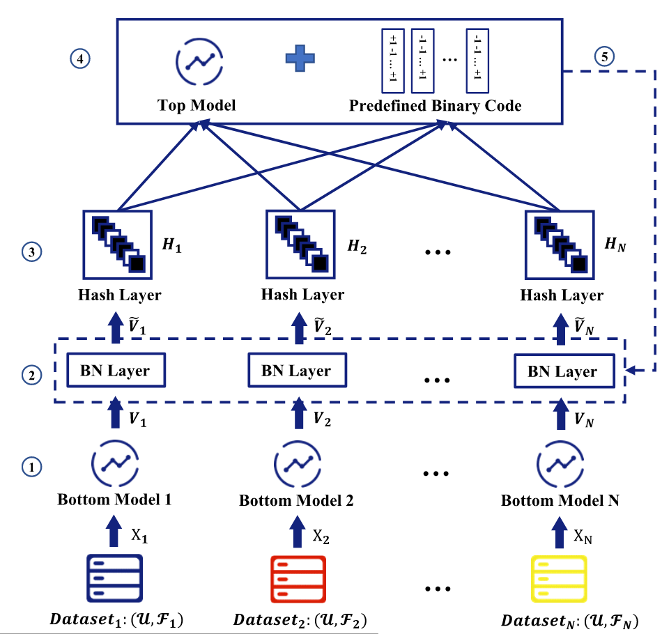
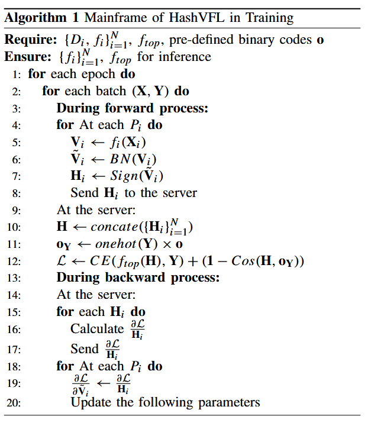

# HashVFL: Defending Against Data Reconstruction Attacks in Vertical Federated Learning


## Introduction

[18]、[19]、[20]、[21]中的研究表明，对手可以通过使用样本的后验概率和VFL模型的参数来重建中间结果，甚至目标方的原始数据。这些成功的数据重建攻击背后的原因是深度神经网络（DNN）能够对中间计算和原始输入之间的相关性进行建模。

为了消除可逆性，我们提出了一个新的VFL框架，称为HashVFL，它使用哈希。哈希的单向性允许我们的框架阻止从哈希代码恢复中间计算或原始输入的所有尝试。然而，哈希的集成使得模型在训练期间很难学习，因为梯度消失了。此外，哈希丢弃信息，并且为了保护隐私，哈希代码的长度必须最小化。这两个因素将不可避免地影响模型的性能。鉴于上述考虑，我们的HashVFL框架的设计解决了以下三个挑战：

- 可学习性。解决方案是识别具有易于估计梯度的哈希函数，以便模型可以继续训练并保持其性能。1）添加Sign函数以将各方的中间计算二值化。这是哈希[27]和二进制神经网络[28]中使用的一种常见技术。2）在反向传播中，我们采用了直通估计量[29]，[30]。这允许渐变完全按原样通过Sign函数，避免渐变消失。
- 降低信息泄露。为了解决这一挑战，我们引入了位平衡的概念。这是指在给定有限的哈希代码长度的情况下，最大化每个比特所携带的信息。理想情况下，我们的目标是一半的样本在每个比特上取1/-1的值。这最大化了整个哈希代码可以携带的信息。为了满足上述要求，我们建议使用批量归一化（BN）[31]。BN将一批样本中每个维度的中间计算归一化为标准正态分布。这意味着批次中大约一半的样本将具有正值，一半的样本在每个维度上将具有负值。
- 一致性。**同类样本的哈希码应该是尽可能一致的。**


## 符号定义

N个参与方$\{P_1,P_2,...,P_N\}$正在处理分类任务，各方的数据集$\{D_1,D_2,...,D_N\}$。每个数据集$D_i$可以分为$(U_i,F_i)$，$U_i$是样本/用户空间(个人理解：样本ID空间)，$F_i$是特征空间。各方重叠的样本空间为$U$。

$P_i$的底部模型为$f_i$：$f_i(\mathbf{x}_i; \theta_i): \mathbb{R}^{d_i} \to \mathbb{R}^{\tilde{d}} $。$\mathbf{x}_i^{(u)}$代表在$P_i$处样本$u$的特征。$\mathbf{v}_i^{(u)}$代表在$P_i$处样本$u$经过$f_i$的输出结果。

$\mathbf{v}_i^{(u)}$最后发送到第三方服务器进行聚合和进一步计算。$\mathbf{v}_{cat}^{(u)}=[\mathbf{v}_1^{(u)},\mathbf{v}_2^{(u)},...,\mathbf{v}_N^{(u)}]$代表各方输出结果的拼接。

$f_{top} \left({v}_{cat}; \theta_{top} \right): \mathbb{R}^{N \times \tilde{d}} \rightarrow \mathbb{R}^{C}$为服务器端的模型，$C$代表了类别数量。服务器端模型的目标就是将$\mathbf{v}_{cat}^{(u)}$转为$\mathbf{v}_{top}^{(u)}$，$\mathbf{v}_{top}^{(u)}$就是分类结果。

最后$\mathbf{v}_{top}^{(u)}$会发给拥有标签的一方（$y^{u}$表示样本$u$的标签），由该方来计算损失。整体模型可表示如下：
$$
\min_{\{\theta_{i}\}_{i=1}^{N},\theta_{top}}\mathbb{E}_{u\in\mathcal{U}}[\ell (\mathbf{x}_{1}^{(u)},\mathbf{x}_{2}^{(u)},\cdots,\mathbf{x}_{N}^{(u)}, y; \{\theta_{i}\}_{i=1}^{N} ,\theta_{top})],
$$


## 数据重建攻击

在[39]中，Zhu等人证明了可以从泄漏的梯度中重建敏感信息。他们通过允许生成样本的梯度接近目标样本的梯度来实现这一点，这种攻击可以公式化为：
$$
\tilde{\mathbf{x}}^{\ast}, \tilde{y}^{\ast}=\operatorname*{arg min}_{\tilde {\mathbf{x}}, \tilde{y}}=\left\|\frac{\partial\ell(f(\tilde{\mathbf{x}}, \theta), \tilde{y})}{\partial\theta}-\nabla\theta\right\|^{2},
$$
$\tilde{\mathbf{x}}^{\ast}$是重构样本，$\tilde{y}^{\ast}$重构样本的推断标签。$\nabla\theta$是真实样本的梯度，$\frac{\partial\ell(f(\tilde{\mathbf{x}}, \theta), \tilde{y})}{\partial\theta}$是重构样本的梯度。


在[26]中，He等人统一了模型窃取和数据重建攻击。攻击可以公式化为：
$$
\left\{ \begin{array}{ll}\tilde{\mathbf{x}}^{*} = \arg \min_{\tilde{\mathbf{x}}}\ell (f_{\tilde{\theta}}(\tilde{\mathbf{x}}),f_{\theta}(\mathbf{x})) + L(\tilde{\mathbf{x}})\\ \tilde{\theta}^{*} = \arg \min_{\tilde{\theta}}\ell (f_{\tilde{\theta}}(\tilde{\mathbf{x}}),f_{\theta}(\mathbf{x})), \end{array} \right.
$$
$\tilde{\mathbf{x}}^*$代表重构样本；$f$是模型；$\theta$是模型参数；$\tilde{\theta}^{*}$是重构的近似参数。$\ell (\cdot ,\cdot)$代表二者之间的距离；$L(\tilde{\mathbf{x}})$代表$\tilde{\mathbf{x}}$惩罚函数，以指导生成。


总之，由于深度神经网络的近似能力，侧信道信息（如梯度和中间计算结果）可能会揭示敏感信息。


## 哈希

与传统哈希函数相比，**依赖于数据的哈希方法**在其设计中保留关于输入数据的信息。这篇文章使用的是Learning to hash。

**Learn to Hash** 指的是**利用机器学习（尤其是深度学习）技术来自动学习或优化哈希函数的过程**。其核心目标是将高维数据（如图像、文本、视频、特征向量）高效且有效地映射成紧凑的二进制哈希码（通常由 0 和 1 组成），同时**尽可能保留原始数据间的==语义相似性关系==**。


与LSH（局部敏感哈希相比），LSH可以根据原始数据之间的欧氏距离、余弦相似度来保持哈希结果之间的相似性。但是**Learn to Hash** 可以保持数据之间的**”语义相似“**。例如，2张不同姿势的猫照片是相似的，猫和狗的照片是不相似的，这些相似性是LSH无法保持的。


## 威胁模型

所有参与方都是诚实但好奇。此外，假设对手知道参与方的底部模型和样本的哈希码，但各方的本地数据是严格保密的。这是数据重建攻击的最强假设，如果HashVFL可以在这些条件下防御攻击，则在对手知识较少的较弱假设下，它很可能有效。


## 方案




<!-- 1）各方使用其底部模型从本地数据中提取特征向量。2）然后通过BN层对提取的抽象进行归一化。3）归一化特征向量被哈希层二值化，然后上传到服务器。4）服务器使用顶级模型来计算分类损失以及这些代码与其目标预定义二进制代码之间的距离。5）服务器计算梯度并将其传输回相应的各方。请注意，梯度通过哈希层，因为它们是由于使用直通估计量（STE），从而使更新能够从批处理规范化层开始的。-->


首先，$P_{i}$从本地对齐数据集中选取小批量数据$\mathbf{X}_i$，然后对其进行特征提取得到$\mathbf{V}_i$。


接下来，让$\mathbf{V}_i$经过批量归一化层（这是强制性的）得到$\tilde{\mathbf{V}}_i$。转换后的输出$\tilde{\mathbf{V}}_i$现在在每个维度上实现平衡，从而满足我们的“位平衡”要求。然后让$\tilde{\mathbf{V}}_i$经过哈希层，得到$\mathbf{H}_i$。


最后，服务器拼接各参与方交上来的$\mathbf{H}_i$得到$\mathbf{H} = [\mathbf{H}_1,\dots ,\mathbf{H}_N]$。服务器利用$\mathbf{H}$计算后验概率（也就是分类结果）。然后将后验概率和真实分类结果$\mathbf{Y}$进行比较，计算损失。同时，==**为了一致性要求**==，$H_i$还要和预定义的二进制码$\mathbf{o}\in \{- 1, + 1\}^{C\times \tilde{d}}$ （**根据标签预定义**）进行距离计算（$\tilde{d}$是哈希码的大小）。

最终的损失函数如下：
$$
\mathcal{L} = CE(f_{top}(\mathbf{H}),\mathbf{Y}) + (\mathbf{1} - Cos(\mathbf{H},\mathbf{o_Y})),
$$
这里的CE就是分类任务的损失函数，一般是交叉熵损失函数。$(\mathbf{1} - Cos(\mathbf{H},\mathbf{o_Y})$代表余弦距离损失项。$\mathbf{o_Y}$代表了这一小批量数据的标签对应的预定义二进制码。


**在反向传播过程中，梯度在通过哈希层时直接传递**。因此，只需要更新BN层的参数和θi。





### BN层

白化（常用的白化方法：PCA）：**解除每个样本特征之间的线性相关性，实现特征独立，可以加速模型的收敛**；**使所有特征均值为0、方差为1（标准化），抑制特征冗余导致的过拟合，统一特征尺度使梯度下降方向更稳定，加速收敛**。由于解除每个样本特征之间的线性相关性计算量过大，因此一般我们只做第二个。代码如下：

```python
###处理图像数据
#通道级标准化，对每个颜色通道进行标准化
normalize = torchvision.transforms.Normalize(mean=[0.485, 0.456, 0.406], 
                                std=[0.229, 0.224, 0.225])


###处理表格数据
#初始化转换器（仅对数值列）
numeric_cols = X_train.select_dtypes(include=['int64', 'float64']).columns
scaler = StandardScaler()
#拟合并转换训练集
X_train[numeric_cols] = scaler.fit_transform(X_train[numeric_cols])

#用相同参数转换测试集
X_test[numeric_cols] = scaler.transform(X_test[numeric_cols])
```


BN层的目的有3个：

- 解决内部协变量偏移（Internal Covariate Shift）：解决网络层输入分布随训练动态变化的问题，稳定深度网络训练
- 统一每一层的输入尺度：使每层输入的均值为0、方差为1，避免梯度消失/爆炸。


给定一个Batch$\begin{array}{rlr}{\mathcal{B}}&{=}&{\left\{\mathbf{x}^{(1)},\mathbf{x}^{(2)}\right.}\end{array} \dots ,\mathbf{x}^{(m)}\}$，$m$代表Batch的大小。


BN层首先使用Batch的均值$\begin{array}{r}\mu_{\mathcal{B}}:\frac{1}{m}\Sigma_{i = 1}^{m}\mathbf{x}^{(i)} \end{array}$ 和方差 $\begin{array}{r}\sigma_{\mathcal{B}}^{2}:\frac{1}{m}\Sigma_{i = 1}^{m}(\mathbf{x}^{(i)} - \mu_{\mathcal{B}})^{2} \end{array}$归一化每个$\mathbf{x}^{(i)}$得到$\bar{\mathbf{x}}^{(i)}$，例如$\bar{\mathbf{x}}^{(i)}:\frac{\mathbf{x}^{(i)} - \mu_{\mathcal{B}}}{\sqrt{\sigma_{\mathcal{B}}^{2} + \epsilon}}$（其中的 $\epsilon$ 是为了防止分母是0）。因此（$\epsilon$ 很小，可以忽略不记），**$\bar{\mathbf{x}}^{(i)}$服从标准正态分布**，这样就可以保证在每个批次中，样本每个位上均匀分配正值和负值（统计意义）。


然而，如果仅仅使用上面的归一化公式，对网络某一层A的输出数据做归一化，然后送入网络下一层B，这样是会影响到本层网络A所学习到的特征的。因此，BN层中还有另外两个参数 $\gamma$ 和$\beta$ 用于缩放和移动归一化值：$\bar{\mathbf{x}}^{(i)} = \gamma \bar{\mathbf{x}}^{(i)} + \beta$。通过这种方式，如果需要，BN层可以恢复原始激活值。


During inference, for a batch of samples $\mathcal{B}_{inf}$ , we transform them with $\begin{array}{r}\bar{\mathbf{x}} = \frac{\gamma}{\sqrt{Var[\mathbf{x}] + \epsilon}}\bar{\mathbf{x}} +(\beta - \frac{\gamma\mathbb{E}[\mathbf{x}]}{\sqrt{Var[\mathbf{x}] + \epsilon}}) \end{array}$ , where $\mathbb{E}[\mathbf{x}] =$ $\mathbb{E}\mathcal{B}_{inf}[\mu \mathcal{B}_{inf}]$ and $\begin{array}{r}Var[\mathbf{x}] = \frac{m}{m - 1}\mathbb{E}\mathcal{B}_{inf}[\sigma \mathcal{B}_{inf}] \end{array}$ 


### 哈希层

**Learn to Hash** 指的是**利用机器学习（尤其是深度学习）技术来自动学习或优化哈希函数的过程**。其核心目标是将高维数据（如图像、文本、视频、特征向量）高效且有效地映射成紧凑的二进制哈希码（通常由 0 和 1 组成），同时**尽可能保留原始数据间的==语义相似性关系==**。


与LSH（局部敏感哈希相比），LSH可以根据原始数据之间的欧氏距离、余弦相似度来保持哈希结果之间的相似性。但是**Learn to Hash** 可以保持数据之间的**”语义相似“**。例如，2张不同姿势的猫照片是相似的，猫和狗的照片是不相似的，这些相似性是LSH无法保持。


learning to hash的核心思想是：训练一个模型$f(x;\theta)$，输入是原始数据$x$，输出是一个低维的实值向量，这个向量被称为”连续哈希码“。然后对输出结果进行二值化处理，也就是把输出变成一个2进制比特串。最常见的二值化处理就是符号函数。
$$
h = S i g n(v) = \left\{ \begin{array}{l l}{+1} & {if \quad v\geq 0}\\ {-1} & {o t h e r w i s e,} \end{array} \right.
$$
本文也使用符号函数来进行二值化，上面的$h$就是输入$v$的二进制哈希码。**由于符号函数不可导，所以直接认为符号函数对$v$的导数$\frac{\partial\mathbf{h}}{\partial\mathbf{v}}\approx  1$。**（有点离谱）
$$
\mathbf{g} = \frac{\partial\mathcal{L}}{\partial\mathbf{v}} = \frac{\partial\mathcal{L}}{\partial\mathbf{h}}\cdot \frac{\partial\mathbf{h}}{\partial\mathbf{v}}\approx \frac{\partial\mathcal{L}}{\partial\mathbf{h}},
$$


**每个本地模型的哈希层输出大小都是一样的，和标签的预定义哈希码大小一样。**


### 标签的预定义哈希码

According to [51]，2个向量$\mathbf{v}_i$和$\mathbf{v}_j$具有相同哈希码的概率是$1 - \frac{\theta_{ij}}{\pi}$，$\theta_{ij}$是2个向量之间的角度。因此，为了使不同标签的样本的哈希码有区别，我们应该让预定义的二进制码尽可能独立，即彼此正交。


**为了实现正交性，我们在==$p=\frac{1}{2}$==下的伯努利分布下随机生成二进制码，$p$代表每个bit是+1的概率。伯努利分布（扔硬币实验）是一种二值分布，假设1的概率是$p$，0的概率是$q=1-p$，它概率密度函数如下：**
$$
P \left( x \right)=p^{x} \left( 1-p \right)^{1-x}= \left \{ \begin{matrix} p& if \quad x=1 \\ q& if \quad x=0 \end{matrix} \right.
$$
文章中有证明，==$p=\frac{1}{2}$==是最好的。


==**实际实现如下:**==

$(nums\_class)$代表标签种类数量，$encode\_length$代表编码长度，$encode\_length=log_2{(nums\_class)}$

**生成一个大小为$(nums\_class)\times encode\_length$的矩阵$ortho\_target$，矩阵的每一行代表一个标签对应的二进制哈希码，每一行都由二项分布生成$\{-1,+1\}^{encode\_length}$**。

然后用独热编码对标签进行编码生成$y\_one\_hot$，大小为$$(nums\_class)\times (nums\_class)$$。然后对2个矩阵进行矩阵乘法`target = torch.matmul(y_one_hot, ortho_target.to(device))`，得到最终的标签的预定义哈希码。**（其实还是和真实标签没什么关系，独热编码后再乘$ortho\_target$和直接第i个标签选$ortho\_target$的第i行没有区别）**


### 距离的度量

对于二进制码，汉明距离和余弦相似度是等价的。

**最小化汉明距离等于最小化两个二进制码之间的角度，这也意味着最大化它们之间的余弦相似性。**


## 参考文献

[18] X. Luo, Y. Wu, X. Xiao, and B. C. Ooi, “Feature inference attack on model predictions in vertical federated learning,” 2020, arXiv:2010.10152.

[19] H. Weng, J. Zhang, F. Xue, T. Wei, S. Ji, and Z. Zong, “Privacy leakage of real-world vertical federated learning,” 2021, arXiv:2011.09290.

[20] P. Qiu et al., “Your labels are selling you out: Relation leaks in vertical federated learning,” IEEE Trans. Dependable Secure Comput., vol. 20, no. 5, pp. 3653–3668, Sep./Oct. 2023, doi: 10.1109/TDSC.2022.3208630.

[21] C. Fu et al., “Label inference attacks against vertical federated learning,” in Proc. 31st USENIX Secur. Symp., Boston, MA, USA, Aug. 2022, pp. 1397–1414. [Online]. Available: https://www.usenix.org/conference/usenixsecurity22/presentation/fu-chong

[26] Z. He, T. Zhang, and R. B. Lee, “Model inversion attacks against collaborative inference,” in Proc. 35th Annu. Comput. Secur. Appl. Conf., Dec. 2019, pp. 148–162.

[39] L. Zhu, Z. Liu, and S. Han, “Deep leakage from gradients,” in Proc. NIPS, 2019, pp. 1–11.

[33] J. T. Hoe, K. W. Ng, T. Zhang, C. S. Chan, Y.-Z. Song, and T. Xiang, “One loss for all: Deep hashing with a single cosine similarity based learning objective,” in Proc. Adv. Neural Inf. Process. Syst., vol. 34, M. Ranzato, A. Beygelzimer, Y. Dauphin, P. Liang, and J. W. Vaughan, Eds. Red Hook, NY, USA: Curran Associates, 2021, pp. 24286–24298.

[51] M. Charikar, “Similarity estimation techniques from rounding algorithms,” in Proc. STOC, 2002, pp. 380–388.

