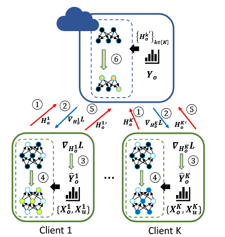
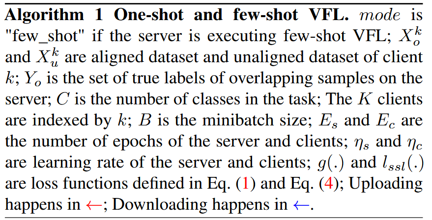
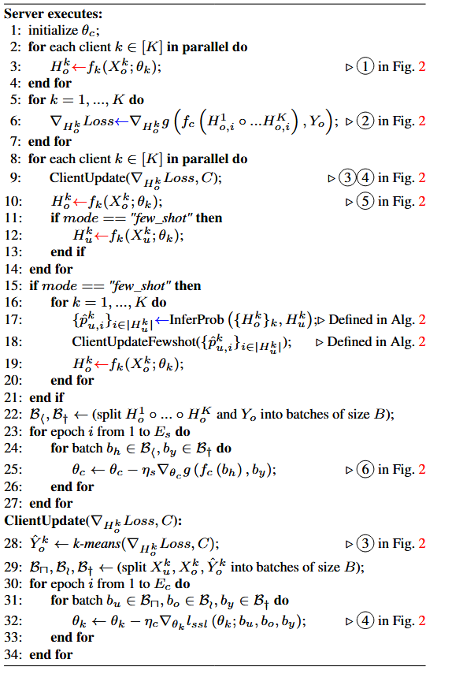
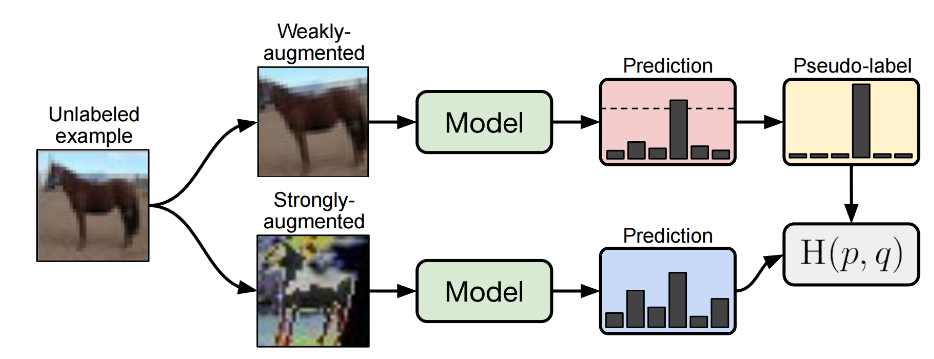
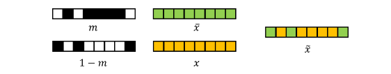
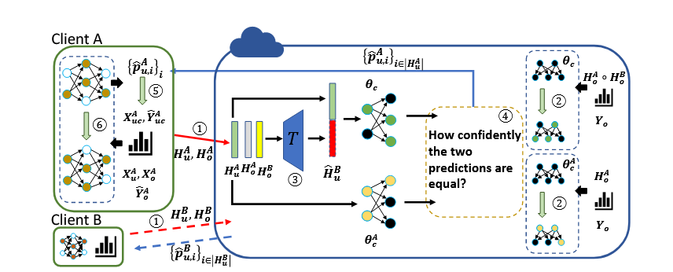

# Communication-Efficient Vertical Federated Learning  with Limited Overlapping Samples

2个挑战：高通信和有限的重叠样本。

例如，预计不同国家的两家医院不会有大量重叠患者。用有限的重叠样本训练的模型可能无法实现可靠的性能。

贡献：

- 我们提出了一种通信高效的VFL算法，称为one-shot VFL。据我们所知，oneshot VFL是第一个可以同时解决高通信成本和有限重叠样本的挑战的算法。
- 我们提出了few-shot VFL，可以在具有最小重叠采样的设置下进一步提高性能。
- 精度提高了


用到的技术：半监督学习


## 参数定义

K个客户端和一个server

**对齐数据集**大小为$N_0:\{x_{o,i},y_{o,i}\}_{i=1}^{N_0}$，每个样本的特征分布在不同客户端手里：$\{x_{o,i}^k\in R^{d_k}\}_{i=0}^{N_0}$，$d_k$表示客户端k持有的特征维度

客户端k手中的**对齐数据集**定义为$X_o^k$，总的**对齐数据集**定义为$X_o$


对于每个客户端，除了手中的**对齐数据集**，还应该有$N_k$个**没有对齐的本地样本**，定义为$X_u^k$。

服务器有**对齐数据集的真实标签**$Y_o=\{y_o^i\}_{i=1}^{N_0}$，其中$y_o^i$表示**对齐数据集**第i个样本的标签


<center>图1 数据集划分</center>


每个客户端（k-th）学习一个特征提取器$f_k(.;\theta_k)$，$h_{o,i}^k$表示客户端k本地特征提取器的输出。服务器学习一个分类器$f_c(.;\theta_c)$

客户端在对齐数据集$X_o^k$上得到的输出记为$H_o^k$

$\Theta=[\theta_1;\cdots;\theta_k;\theta_c]$

$g(.)$表示损失函数

**各客户端的任务就是在不共享数据$X_o^k$和参数$\theta_k$的条件下，训练本地模型**

**服务器的任务就是在不共享参数$\theta_c$和标签$Y_o$的条件下优化$\theta_k$**


## One-Shot VFL


<center>图2 One-Shot VFL流程图</center>

上图就是One-Shot VFL的流程图，**每个客户端上传2次，下载一次**，具体描述如下：

1. 客户端k提取对齐数据$X_o^k$的特征$H_o^k$，然后把$H_o^k$发送到服务器。
2. ==服务器聚合收到的特征，并使用真实标签计算损失。然后利用反向传播计算$\nabla_{H_o^k}Loss$。随后把**部分梯度和对应的对齐数据集标签类别数量$C$**发送给相应的客户端。==
3. ==客户端k收到部分梯度之后，他对部分梯度进行k-means，之后使用相应梯度的聚类指数给对齐数据集$X_o^k$赋予临时标签$\hat{Y_o^k}$。
    **解释：**聚类的直觉在于，同一类的部分梯度应该具有相似的方向，而不同类的部分梯度则应该具有较高的多样性。通过对部分梯度进行聚类，客户端可以推断服务器上的真实标签信息，以指导本地训练。==

==**这个让客户端猜样本标签的过程感觉可以优化**==

4. 根据分配给重叠样本的临时标签，客户端基于$\{X_o^k,\hat{Y_o^k}\}$和$X_u^k$进行半监督学习，以获得更新的本地参数$W_k^{'}$
5. 在第k个客户端完成本地半监督训练后，通过计算$f_k(X_o^k;W_k^{'})$得到新的本地输出${H_o^k}^{'}$，然后把${H_o^k}^{'}$发给服务器（这是一个同步的过程，必须等所有人都算完）
6. 最后，服务器聚合收上来的$\{{H_o^k}^{'}\}$得到总的全局特征${H_o}^{'}$，然后用这个全局特征和标签对分类器进行微调









### 本地半监督学习

客户端在$\{X_o^k,\hat{Y_o^k}\}$,$X_o^k$上进行半监督学习，损失函数如下：
$$
l_{ssl}\left(\theta_k;X_u^k,X_o^k,\hat{Y}_o^k\right)=l_s\left(\theta_k;X_o^k,\hat{Y}_o^k\right)+\lambda_ul_u\left(\theta_k;X_u^k\right)
$$
$l_s(.)$是监督学习的损失函数，$l_u(.)$是半监督学习的损失函数，$\lambda_u$控制着两者之间的平衡


这篇论文使用了FixMatch[1]作为半监督学习的框架

[1] Kihyuk Sohn, David Berthelot, Nicholas Carlini, Zizhao Zhang, Han Zhang, Colin A Raffel, Ekin Dogus Cubuk, Alexey Kurakin, and Chun-Liang Li. Fixmatch: Simplifying semi-supervised learning with consistency and confidence. Advances in neural information processing systems, 33:596608, 2020.



<center>图3 FixMatch流程图</center>

FixMatch本用于图像分类，**代码中弱增强主要是做了裁剪和随机水平翻转**，**强增强会从下面的操作池中随机选择几个，强度越大，选择的操作越多**，**最后还会随机遮挡部分图像**：

```python
def my_augment_pool():
    # 自定义增强操作池，用于测试
    augs = [
        (AutoContrast, None, None),  # 自动对比度调整
        (Brightness, 1.8, 0.1),      # 亮度调整，最大增强强度1.8，偏差0.1
        (Color, 1.8, 0.1),           # 颜色调整，最大增强强度1.8，偏差0.1
        (Contrast, 1.8, 0.1),        # 对比度调整，最大增强强度1.8，偏差0.1
        (Cutout, 0.2, 0),            # 随机遮挡，最大遮挡比例0.2
        (Equalize, None, None),      # 直方图均衡化
        (Invert, None, None),        # 颜色反转
        (Posterize, 4, 4),          # 色调分离，保留4位
        (Rotate, 30, 0),            # 旋转，最大角度30度
        (Sharpness, 1.8, 0.1),      # 锐度调整，最大增强强度1.8，偏差0.1
        (ShearX, 0.3, 0),           # 水平剪切，最大剪切比例0.3
        (ShearY, 0.3, 0),           # 垂直剪切，最大剪切比例0.3
        (Solarize, 256, 0),         # 曝光调整，最大阈值256
        (SolarizeAdd, 110, 0),      # 曝光调整并添加噪声，最大噪声强度110
        (TranslateX, 0.45, 0),      # 水平平移，最大平移比例0.45
        (TranslateY, 0.45, 0)       # 垂直平移，最大平移比例0.45
    ]
    return augs
```

FixMatch在训练过程中会把有标签的数据和没有标签的数据混合在一起训练，最后的损失函数如下：

```python
# 计算标记数据的损失
Lx = F.cross_entropy(logits_x, targets_x, reduction='mean')

# 生成伪标签并计算未标记数据的损失

# 对未标记数据的弱增强输出logits进行softmax操作，得到伪标签
pseudo_label = torch.softmax(logits_u_w.detach()/args.T, dim=-1)
# 获取伪标签的最大概率值及其对应的类别
max_probs, targets_u = torch.max(pseudo_label, dim=-1)
# 根据阈值筛选出高置信度的伪标签，生成掩码
mask = max_probs.ge(args.threshold).float()
# 计算未标记数据的损失，仅使用高置信度的伪标签
Lu = (F.cross_entropy(logits_u_s, targets_u, reduction='none') * mask).mean()

# 计算总损失
loss = Lx + args.lambda_u * Lu

```


为了适用于表格型数据这篇论文对FixMatch做了一些修改.

对于弱增强，我们随机生成一个数据点形状相同的二进制掩码 m和1-m。（**下面的图画反了，1-m应该在上面**）${\alpha(x)}={m}\otimes{x}+{(1}-{m})\otimes{\bar{x}}$，$\bar{x}$是本地数据对应元素的均值。



对于强增强，我们向掩码样本中添加噪声。$A(x)=\alpha(x)+n$


## Few-shot VFL

尽管一次性VFL可以以极低的通信成本实现全局模型的高性能，我们考虑通过增加几轮通信来进一步提高性能。

假设有2个客户端A,B和一个server



<center>图4 Few-shot VFL流程图</center>

服务器收到来自**客户端A的未对齐样本$X_u^A$的特征向量$H_u^A$**，通过变换层**T**来**估计客户端B相应样本的缺失特征向量$\widehat{H}_{u}^{B}$**，公式表达如下：
$$
\widehat{H}_{u}^{B}=T \left( H_{u}^{A},H_{o}^{A},H_{o}^{B} \right)
$$
然后对于每个未对齐的样本，服务器生成预测：
$$
\begin{align}
\hat{y}_{u,i}^A &= \arg\max_j f_c^A(H_{u,i}^A; \theta_c^A)_j, \\
\hat{p}_{u,i} &= \max_j f_c(H_{u,i}^A; \theta_c^A)_j, \\
\hat{y}_{A,B} &= \arg\max_j f_c(H_{u,i}^A \circ \hat{H}_{u,i}^B; \theta_c^{A,B})_j, \\
\hat{p}_{u,i}^{A,B} &= \max_j f_c(H_{u,i}^A \circ \hat{H}_{u,i}^B; \theta_c^{A,B})_j.
\end{align}
$$
$f_c^A(.)$是一个服务器端的辅助分类器，输入是$H_{u,i}^A$。$\theta_c^{A,B},\theta_c^{A}$是基于对齐数据集的客户端输出

第一个等式左边是**未对齐数据集第i个样本**在服务器的**分类结果**

第二个等式左边是**未对齐数据集第i个样本**在服务器的**分类结果的概率**

第三个等式左边是
